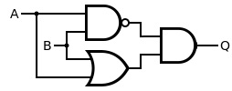
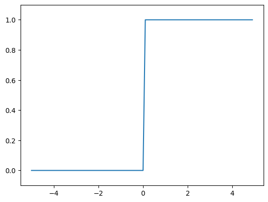

# 목차
* [2. 퍼셉트론](#2-퍼셉트론)

    * [2.3.2. 가중치 편향](#232-가중치-편향)

---
# 2. 퍼셉트론
### 2.3.2. 가중치 편향
#### AND Gate
```python
import numpy as np
x = np.array([0,1]) #입력
w = np.array([0.5,0.5]) #가중치
b = -0.7
'''
>> w*x
array([0, 0.5])
>> np.sum(w*x)
0.5
'''
tmp = np.sum(w*x) +b
if tmp <= 0:
    return 0
else
    return 1
```

#### NAND Gate
```python
def NAND(x1,x2):
    x = np.array([x1,x2])
    w = np.array([-0.5,-0.5])
    b = 0.7
    tmp = np.sum(w*x) + b
    if tmp <= 0:
        return 0
    else
        return 1
```
#### OR
```python
def OR(x1,x2):
    x = np.array([x1,x2])
    w = np.array([0.5,0.5]) #AND와는 가중치 (w와 b)만 다르다!
    b = -0.2
    tmp = np.sum(w*x) + b
    if tmp <= 0:
        return 0
    else:
        return 1
```
AND,NAND, OR 는 모두 같은 구조의 퍼셉트론이고, 차이는 가중치 매개 변수의 값이다.
## 2.4. 퍼셉트론의 한계
AND,NAND,OR의 3가지 논리 회롤르 구현 할 수 있음.
### 2.4.1. XOR 게이트
XOR 게이트는 배타적 논리합

|x_1|x_2|y|
|---|---|---|
|0|0|0|
|1|0|1|
|0|1|1|
|1|1|0|

-> 다층 퍼셉트론 (multi-layer perceptron)을 만들어야함.



|x_1|x_2|s_1|s_2|
|---|---|---|---|
|0|0|1|0|0
|1|0|1|1|1
|0|1|1|1|1
|1|1|0|1|0
```python
def XOR(x1,x2):
    s1 = NAND(x1,x2)
    s2 = OR(x1,x2)
    y = AND(s1,s2)
    return y
```
```
[결과]
XOR(0,0) # 0을 출력
XOR(1,0) # 1을 출력
XOR(0,1) # 1을 출력
XOR(1,1) # 0을 출력
```
# 3.신경망
### 3.2.3. 계단 함수 그래프

```python
import numpy as np
import matplotlib.pyplot as plt
def step_function(x):
    return np.array(x > 0, dtype=int)
x = np.arange(-5.0, 5.0, 0.1)
y = step_function(x)
plt.plot(x, y)
plt.ylim(-0.1, 1.1)
plt.show()
```

### 3.2.4. 시그모이드 함수 구현하기
```python
def sigmoid(x):
    return 1/(1+np.exp(-x))
```

### 3.2.6 비선형함수
신경망에서는 활성화 함수로 비션형 함수를 사용해야함.
-> 선형함수를 사용해서는 안됨.

y?
>선형함수를 이용하면 신경망의 층을 깊게하는 의미가 없어짐.
### 3.2.7 ReLU 함수
입력이 0을 넘으면 그 입력을 그대로 출려하고, 0이하면 0을 출력
x (x>0)
0(x<=0)
```python
def relu(x):
    return np.maximum(0, x)
```

넘파이의 maximum을 사용
maximum은 두 입력 중 큰 값 선택.

## 3.3 다차원 배열 계산
```python
def init_network():
    network = {}
    network['W1'] = np.array([[0.1, 0.3, 0.5], [0.2, 0.4, 0.6]])
    network['b1'] = np.array([0.1, 0.2, 0.3])
    network['W2'] = np.array([[0.1, 0.4], [0.2, 0.5], [0.3, 0.6]])
    network['b2'] = np.array([0.1, 0.2])
    network['W3'] = np.array([[0.1, 0.3], [0.2, 0.4]])
    network['b3'] = np.array([0.1, 0.2])
    
    return network
def forward(network, x):
    W1, W2, W3 = network['W1'], network['W2'], network['W3']
    b1, b2, b3 = network['b1'], network['b2'], network['b3']
    
    a1 = np.dot(x, W1) + b1
    z1 = sigmoid(a1)
    a2 = np.dot(z1, W2) + b2
    z2 = sigmoid(a2)
    a3 = np.dot(z2, W3) + b3
    y = a3
    
    return y
network = init_network()
x = np.array([1.0, 0.5])
y = forward(network, x)
print(y)  # 출력값이 0.31682708, 0.69627909가 나옴
```
## 3.5 출력층 설계하기
```python
def softmax(a):
    exp_a = np.exp(a)
    sum_exp_a = np.sum(exp_a)
    y = exp_a / sum_exp_a
    return y
```
소프트맥스 함수구현 시 주의점

# 3장 신경망 - 시험 대비 핵심 정리

## 1. 퍼셉트론에서 신경망으로

### 퍼셉트론 vs 신경망

```python
"""
퍼셉트론:
- 가중치를 수동으로 설정
- 활성화 함수: 계단 함수 (0 or 1)

신경망:
- 가중치를 데이터로부터 자동으로 학습
- 활성화 함수: 시그모이드, ReLU 등 (연속적)
"""
```

### 신경망의 구조

```
입력층 → 은닉층 → 출력층
(Input) (Hidden) (Output)

예: 3층 신경망
입력층(2) → 은닉층(3) → 출력층(2)
```

---

## 2. 활성화 함수 ⭐⭐⭐

### 2.1 계단 함수 (Step Function)

**수식:**
$$h(x) = \begin{cases}
0, & (x \leq 0) \\
1, & (x > 0)
\end{cases}$$

**구현:**
```python
import numpy as np

def step_function(x):
    return np.array(x > 0, dtype=int)

# 테스트
x = np.array([-1.0, 0.0, 1.0, 2.0])
print(step_function(x))  # [0 0 1 1]
```

**특징:**
- 불연속 함수
- 미분 불가능 (학습 불가)
- 퍼셉트론에서 사용

---

### 2.2 시그모이드 함수 (Sigmoid) ⭐⭐⭐

**수식:**
$$h(x) = \frac{1}{1 + e^{-x}}$$

**구현:**
```python
def sigmoid(x):
    return 1 / (1 + np.exp(-x))

# 테스트
x = np.array([-1.0, 0.0, 1.0, 2.0])
print(sigmoid(x))
# [0.26894142 0.5 0.73105858 0.88079708]
```

**특징:**
- 연속 함수
- 미분 가능 (학습 가능)
- 출력: 0 ~ 1 사이
- 부드러운 곡선

**그래프 비교:**
```python
import matplotlib.pyplot as plt

x = np.arange(-5.0, 5.0, 0.1)
y_step = step_function(x)
y_sigmoid = sigmoid(x)

plt.plot(x, y_step, linestyle='--', label='Step')
plt.plot(x, y_sigmoid, label='Sigmoid')
plt.ylim(-0.1, 1.1)
plt.legend()
plt.show()
```

---

### 2.3 ReLU 함수 (Rectified Linear Unit) ⭐⭐⭐

**수식:**
$$h(x) = \max(0, x) = \begin{cases}
x, & (x > 0) \\
0, & (x \leq 0)
\end{cases}$$

**구현:**
```python
def relu(x):
    return np.maximum(0, x)

# 테스트
x = np.array([-1.0, 0.0, 1.0, 2.0])
print(relu(x))  # [0. 0. 1. 2.]
```

**특징:**
- 연속 함수
- 계산이 매우 간단
- 기울기 소실 문제 완화
- **현대 신경망에서 가장 많이 사용**

---

### 활성화 함수 비교표

| 함수 | 수식 | 출력 범위 | 미분 가능 | 사용 위치 |
|:----:|:-----|:---------:|:---------:|:----------|
| **Step** | $h(x) = \begin{cases}0 & (x \leq 0) \\ 1 & (x > 0)\end{cases}$ | {0, 1} | ❌ | 퍼셉트론 |
| **Sigmoid** | $h(x) = \frac{1}{1+e^{-x}}$ | (0, 1) | ✅ | 은닉층, 이진분류 |
| **ReLU** | $h(x) = \max(0, x)$ | [0, ∞) | ✅ | 은닉층 (현대) |
| **Tanh** | $h(x) = \frac{e^x - e^{-x}}{e^x + e^{-x}}$ | (-1, 1) | ✅ | 은닉층 |

---

## 3. 다차원 배열 계산 ⭐⭐

### 행렬의 형상

```python
import numpy as np

# 1차원 배열
A = np.array([1, 2, 3, 4])
print(A.shape)  # (4,)
print(A.ndim)   # 1

# 2차원 배열 (행렬)
B = np.array([[1, 2], [3, 4], [5, 6]])
print(B.shape)  # (3, 2) - 3행 2열
print(B.ndim)   # 2

# 3차원 배열
C = np.array([[[1, 2], [3, 4]], [[5, 6], [7, 8]]])
print(C.shape)  # (2, 2, 2)
print(C.ndim)   # 3
```

### 행렬의 내적 (Dot Product) ⭐⭐⭐

```python
# 행렬 곱셈 규칙: (m, n) × (n, k) = (m, k)

A = np.array([[1, 2], [3, 4]])      # (2, 2)
B = np.array([[5, 6], [7, 8]])      # (2, 2)
C = np.dot(A, B)
print(C)
# [[19 22]
#  [43 50]]
print(C.shape)  # (2, 2)

# 형상이 맞지 않으면 오류
A = np.array([[1, 2, 3], [4, 5, 6]])  # (2, 3)
B = np.array([[1, 2], [3, 4]])        # (2, 2)
# np.dot(A, B)  # 오류! (2,3) × (2,2) 불가능

# 올바른 예
A = np.array([[1, 2, 3], [4, 5, 6]])  # (2, 3)
B = np.array([[1, 2], [3, 4], [5, 6]]) # (3, 2)
C = np.dot(A, B)                       # (2, 2) ✅
print(C)
# [[22 28]
#  [49 64]]
```

**핵심 규칙:**
- **(m, n) × (n, k) = (m, k)**
- 앞 행렬의 열 수 = 뒤 행렬의 행 수

---

## 4. 3층 신경망 구현 ⭐⭐⭐

### 신경망 구조

```
입력층(2) → 은닉층1(3) → 은닉층2(2) → 출력층(2)
```

### 전체 구현

```python
import numpy as np

def sigmoid(x):
    return 1 / (1 + np.exp(-x))

def identity_function(x):
    return x

def init_network():
    """신경망 초기화"""
    network = {}
    
    # 입력층 → 은닉층1
    network['W1'] = np.array([[0.1, 0.3, 0.5],
                              [0.2, 0.4, 0.6]])  # (2, 3)
    network['b1'] = np.array([0.1, 0.2, 0.3])   # (3,)
    
    # 은닉층1 → 은닉층2
    network['W2'] = np.array([[0.1, 0.4],
                              [0.2, 0.5],
                              [0.3, 0.6]])       # (3, 2)
    network['b2'] = np.array([0.1, 0.2])        # (2,)
    
    # 은닉층2 → 출력층
    network['W3'] = np.array([[0.1, 0.3],
                              [0.2, 0.4]])       # (2, 2)
    network['b3'] = np.array([0.1, 0.2])        # (2,)
    
    return network

def forward(network, x):
    """순전파"""
    W1, W2, W3 = network['W1'], network['W2'], network['W3']
    b1, b2, b3 = network['b1'], network['b2'], network['b3']
    
    # 입력층 → 은닉층1
    a1 = np.dot(x, W1) + b1
    z1 = sigmoid(a1)
    
    # 은닉층1 → 은닉층2
    a2 = np.dot(z1, W2) + b2
    z2 = sigmoid(a2)
    
    # 은닉층2 → 출력층
    a3 = np.dot(z2, W3) + b3
    y = identity_function(a3)  # 또는 y = a3
    
    return y

# 실행
network = init_network()
x = np.array([1.0, 0.5])
y = forward(network, x)
print(y)  # [0.31682708 0.69627909]
```

### 형상 추적

```python
"""
입력: x (2,)

Layer 1:
  W1: (2, 3)
  b1: (3,)
  a1 = x·W1 + b1 → (2,)·(2,3) + (3,) = (3,)
  z1 = sigmoid(a1) → (3,)

Layer 2:
  W2: (3, 2)
  b2: (2,)
  a2 = z1·W2 + b2 → (3,)·(3,2) + (2,) = (2,)
  z2 = sigmoid(a2) → (2,)

Layer 3:
  W3: (2, 2)
  b3: (2,)
  a3 = z2·W3 + b3 → (2,)·(2,2) + (2,) = (2,)
  y = identity(a3) → (2,)

출력: y (2,)
"""
```

---

## 5. 출력층 설계 ⭐⭐⭐

### 5.1 항등 함수 (회귀 문제)

```python
def identity_function(x):
    return x

# 출력층
y = identity_function(a3)
```

**사용:** 회귀 문제 (연속적인 값 예측)

---

### 5.2 소프트맥스 함수 (분류 문제) ⭐⭐⭐

**수식:**
$$y_k = \frac{\exp(a_k)}{\displaystyle\sum_{i=1}^{n}\exp(a_i)}$$

**기본 구현:**
```python
def softmax(a):
    exp_a = np.exp(a)
    sum_exp_a = np.sum(exp_a)
    y = exp_a / sum_exp_a
    return y

a = np.array([0.3, 2.9, 4.0])
y = softmax(a)
print(y)           # [0.01821127 0.24519181 0.73659691]
print(np.sum(y))   # 1.0
```

**오버플로 방지 버전:**
```python
def softmax(a):
    c = np.max(a)
    exp_a = np.exp(a - c)  # 오버플로 대책
    sum_exp_a = np.sum(exp_a)
    y = exp_a / sum_exp_a
    return y

# 큰 값에서도 안전
a = np.array([1010, 1000, 990])
print(softmax(a))
# [9.99954600e-01 4.53978686e-05 2.06106005e-09]
```

**특징:**
- 출력 합이 1 (확률로 해석 가능)
- 각 원소는 0 ~ 1 사이
- 원소의 대소 관계 유지

**사용:**
- 다중 클래스 분류 문제
- 학습 단계에서 사용
- 추론 단계에서는 argmax만 사용

---

### 출력층 활성화 함수 선택

| 문제 유형 | 활성화 함수 | 출력 |
|:---------|:-----------|:-----|
| 회귀 | 항등 함수 | 실수 |
| 이진 분류 | Sigmoid | 0 ~ 1 (확률) |
| 다중 분류 | Softmax | 0 ~ 1 (확률 분포) |

---

## 6. 배치 처리 ⭐⭐⭐

### 배치 처리의 필요성

```python
# 단일 입력 처리 (느림)
for x in dataset:
    y = network.predict(x)

# 배치 처리 (빠름)
y_batch = network.predict(x_batch)
```

**장점:**
- 행렬 연산 최적화
- GPU 병렬 처리 가능
- 메모리 효율적

### 배치 처리 구현

```python
# 단일 입력
x = np.array([1.0, 0.5])
print(x.shape)  # (2,)

# 배치 입력 (100개)
x_batch = np.array([[1.0, 0.5],
                    [0.2, 0.8],
                    [0.5, 0.3]])
print(x_batch.shape)  # (3, 2)

# 순전파는 동일하게 작동
y_batch = forward(network, x_batch)
print(y_batch.shape)  # (3, 2)
```

### 형상 변화

```python
"""
입력: (배치크기, 입력크기)
예: (100, 784)

W1: (784, 50)
출력1: (100, 50)

W2: (50, 10)
출력2: (100, 10)

최종: (배치크기, 출력크기)
"""
```

---

## 7. MNIST 손글씨 인식 예제 ⭐⭐

### 데이터 로드

```python
from dataset.mnist import load_mnist

# 데이터 로드
(x_train, t_train), (x_test, t_test) = load_mnist(
    normalize=True,      # 0~1로 정규화
    flatten=True,        # 1차원 배열로 변환
    one_hot_label=False  # 레이블을 숫자로
)

print(x_train.shape)  # (60000, 784)
print(t_train.shape)  # (60000,)
print(x_test.shape)   # (10000, 784)
print(t_test.shape)   # (10000,)
```

### 신경망 구현

```python
import pickle

def sigmoid(x):
    return 1 / (1 + np.exp(-x))

def softmax(x):
    c = np.max(x, axis=-1, keepdims=True)
    exp_x = np.exp(x - c)
    return exp_x / np.sum(exp_x, axis=-1, keepdims=True)

def get_data():
    (x_train, t_train), (x_test, t_test) = load_mnist(
        normalize=True, flatten=True, one_hot_label=False
    )
    return x_test, t_test

def init_network():
    """학습된 가중치 로드"""
    with open("sample_weight.pkl", 'rb') as f:
        network = pickle.load(f)
    return network

def predict(network, x):
    """순전파"""
    W1, W2, W3 = network['W1'], network['W2'], network['W3']
    b1, b2, b3 = network['b1'], network['b2'], network['b3']
    
    a1 = np.dot(x, W1) + b1
    z1 = sigmoid(a1)
    
    a2 = np.dot(z1, W2) + b2
    z2 = sigmoid(a2)
    
    a3 = np.dot(z2, W3) + b3
    y = softmax(a3)
    
    return y

# 정확도 계산
x, t = get_data()
network = init_network()

accuracy_cnt = 0
for i in range(len(x)):
    y = predict(network, x[i])
    p = np.argmax(y)  # 확률이 가장 높은 원소의 인덱스
    if p == t[i]:
        accuracy_cnt += 1

print(f"Accuracy: {float(accuracy_cnt) / len(x)}")
```

### 배치 처리 버전

```python
x, t = get_data()
network = init_network()

batch_size = 100
accuracy_cnt = 0

for i in range(0, len(x), batch_size):
    x_batch = x[i:i+batch_size]
    y_batch = predict(network, x_batch)
    
    # axis=1: 각 데이터(행)에서 최댓값의 인덱스
    p = np.argmax(y_batch, axis=1)
    accuracy_cnt += np.sum(p == t[i:i+batch_size])

print(f"Accuracy: {float(accuracy_cnt) / len(x)}")
```

---

## 8. 시험 예상 문제

### 문제 1 (10점)
```
다음 행렬 곱셈의 결과 형상을 구하시오.

(1) A(2, 3) × B(3, 4) = ?
(2) A(5, 2) × B(2, 1) = ?
(3) A(10, 784) × B(784, 50) = ?
```

**답안:**
```python
(1) (2, 4)
(2) (5, 1)
(3) (10, 50)

# 규칙: (m, n) × (n, k) = (m, k)
```

---

### 문제 2 (10점)
```
시그모이드 함수의 수식을 쓰고, 출력 범위를 설명하시오.
```

**답안:**
```
수식: h(x) = 1 / (1 + exp(-x))

출력 범위: 0 < h(x) < 1
- x → -∞일 때, h(x) → 0
- x = 0일 때, h(x) = 0.5
- x → ∞일 때, h(x) → 1

특징: 연속적이고 미분 가능하여 학습에 사용 가능
```

---

### 문제 3 (15점)
```
다음 신경망의 순전파 과정에서 각 층의 출력 형상을 구하시오.

입력: x (100, 784)
W1: (784, 256), b1: (256,)
활성화: ReLU
W2: (256, 128), b2: (128,)
활성화: ReLU
W3: (128, 10), b3: (10,)
활성화: Softmax
```

**답안:**
```python
입력: (100, 784)

Layer 1:
  a1 = x·W1 + b1
  형상: (100, 784)·(784, 256) + (256,) = (100, 256)
  z1 = ReLU(a1)
  형상: (100, 256)

Layer 2:
  a2 = z1·W2 + b2
  형상: (100, 256)·(256, 128) + (128,) = (100, 128)
  z2 = ReLU(a2)
  형상: (100, 128)

Layer 3:
  a3 = z2·W3 + b3
  형상: (100, 128)·(128, 10) + (10,) = (100, 10)
  y = Softmax(a3)
  형상: (100, 10)

최종 출력: (100, 10)
```

---

### 문제 4 (10점)
```
Softmax 함수의 특징 3가지를 설명하시오.
```

**답안:**
```
1. 출력의 합이 1
   - Σy_i = 1이므로 확률로 해석 가능

2. 출력 범위가 0~1
   - 각 원소가 0 < y_i < 1

3. 입력의 대소 관계 유지
   - exp(x)가 단조증가 함수이므로
   - argmax(입력) = argmax(출력)
   
따라서 추론 시에는 Softmax를 생략하고 
argmax만 사용해도 됨
```

---

### 문제 5 (15점)
```
다음 코드의 출력을 예측하고, 각 단계를 설명하시오.

```python
import numpy as np

def softmax(a):
    c = np.max(a)
    exp_a = np.exp(a - c)
    return exp_a / np.sum(exp_a)

a = np.array([1.0, 2.0, 3.0])
y = softmax(a)
print(y)
print(np.sum(y))
print(np.argmax(y))
```
```

**답안:**
```python
# 출력 예측
y ≈ [0.09003057, 0.24472847, 0.66524096]
np.sum(y) = 1.0
np.argmax(y) = 2

# 설명
1. c = 3.0 (최댓값)
2. a - c = [-2.0, -1.0, 0.0]
3. exp(a - c) = [0.13533528, 0.36787944, 1.0]
4. sum = 1.50321472
5. y = exp(a - c) / sum
6. 합은 1.0 (확률 분포)
7. 최댓값 인덱스는 2 (3.0이 가장 큼)
```

---

## 9. 핵심 개념 정리

### ✅ 반드시 알아야 할 것

1. **활성화 함수**
   - 계단 함수: 퍼셉트론, 불연속
   - 시그모이드: 0~1, 연속, 미분 가능
   - ReLU: max(0, x), 현대적, 빠름

2. **행렬 곱셈**
   - (m, n) × (n, k) = (m, k)
   - 앞 열 수 = 뒤 행 수

3. **순전파**
   - a = x·W + b (가중합)
   - z = h(a) (활성화)
   - 층마다 반복

4. **출력층**
   - 회귀: 항등 함수
   - 이진 분류: Sigmoid
   - 다중 분류: Softmax

5. **배치 처리**
   - 여러 데이터를 한 번에 처리
   - 첫 번째 차원이 배치 크기
   - axis=1로 각 샘플별 처리

---

## 10. 빠른 복습 체크리스트

- [ ] 활성화 함수 3가지 (계단, 시그모이드, ReLU)
- [ ] 각 함수의 수식과 특징
- [ ] 행렬 곱셈 형상 계산
- [ ] 순전파 과정 이해
- [ ] 신경망 구현 코드 작성 가능
- [ ] 출력층 활성화 함수 선택 기준
- [ ] Softmax 함수와 특징
- [ ] 배치 처리의 장점
- [ ] axis 매개변수 이해
- [ ] MNIST 예제 흐름 이해

---

## 11. 코드 템플릿 (암기용)

### 3층 신경망 기본 템플릿

```python
import numpy as np

def sigmoid(x):
    return 1 / (1 + np.exp(-x))

def softmax(x):
    c = np.max(x, axis=-1, keepdims=True)
    exp_x = np.exp(x - c)
    return exp_x / np.sum(exp_x, axis=-1, keepdims=True)

def init_network():
    network = {}
    network['W1'] = np.random.randn(입력, 은닉1)
    network['b1'] = np.zeros(은닉1)
    network['W2'] = np.random.randn(은닉1, 은닉2)
    network['b2'] = np.zeros(은닉2)
    network['W3'] = np.random.randn(은닉2, 출력)
    network['b3'] = np.zeros(출력)
    return network

def forward(network, x):
    W1, W2, W3 = network['W1'], network['W2'], network['W3']
    b1, b2, b3 = network['b1'], network['b2'], network['b3']
    
    a1 = np.dot(x, W1) + b1
    z1 = sigmoid(a1)
    
    a2 = np.dot(z1, W2) + b2
    z2 = sigmoid(a2)
    
    a3 = np.dot(z2, W3) + b3
    y = softmax(a3)
    
    return y
```

**시험 화이팅! 🚀**