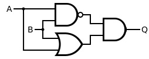
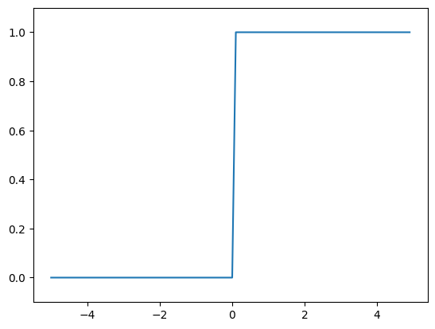
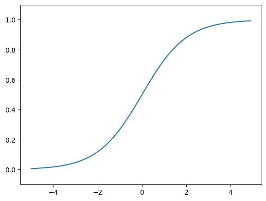
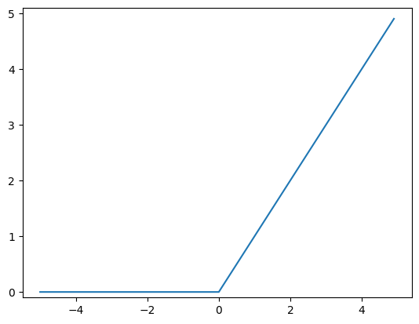

# 목차
* [2. 퍼셉트론](#2-퍼셉트론)

    * [2.3.2. 가중치 편향](#232-가중치-편향)

---
# 2. 퍼셉트론
### 2.3.2. 가중치 편향
#### AND Gate
```python
import numpy as np
x = np.array([0,1]) #입력
w = np.array([0.5,0.5]) #가중치
b = -0.7
'''
>> w*x
array([0, 0.5])
>> np.sum(w*x)
0.5
'''
tmp = np.sum(w*x) +b
if tmp <= 0:
    return 0
else
    return 1
```

#### NAND Gate
```python
def NAND(x1,x2):
    x = np.array([x1,x2])
    w = np.array([-0.5,-0.5])
    b = 0.7
    tmp = np.sum(w*x) + b
    if tmp <= 0:
        return 0
    else
        return 1
```
#### OR
```python
def OR(x1,x2):
    x = np.array([x1,x2])
    w = np.array([0.5,0.5]) #AND와는 가중치 (w와 b)만 다르다!
    b = -0.2
    tmp = np.sum(w*x) + b
    if tmp <= 0:
        return 0
    else:
        return 1
```
AND,NAND, OR 는 모두 같은 구조의 퍼셉트론이고, 차이는 가중치 매개 변수의 값이다.
## 2.4. 퍼셉트론의 한계
AND,NAND,OR의 3가지 논리 회롤르 구현 할 수 있음.
### 2.4.1. XOR 게이트
XOR 게이트는 배타적 논리합

|x_1|x_2|y|
|---|---|---|
|0|0|0|
|1|0|1|
|0|1|1|
|1|1|0|

-> 다층 퍼셉트론 (multi-layer perceptron)을 만들어야함.



|x_1|x_2|s_1|s_2|
|---|---|---|---|
|0|0|1|0|0
|1|0|1|1|1
|0|1|1|1|1
|1|1|0|1|0
```python
def XOR(x1,x2):
    s1 = NAND(x1,x2)
    s2 = OR(x1,x2)
    y = AND(s1,s2)
    return y
```
```
[결과]
XOR(0,0) # 0을 출력
XOR(1,0) # 1을 출력
XOR(0,1) # 1을 출력
XOR(1,1) # 0을 출력
```
# 3.신경망
### 3.2.3. 계단 함수 그래프

```python
import numpy as np
import matplotlib.pyplot as plt
def step_function(x):
    return np.array(x > 0, dtype=int)
x = np.arange(-5.0, 5.0, 0.1)
y = step_function(x)
plt.plot(x, y)
plt.ylim(-0.1, 1.1)
plt.show()
```

### 3.2.4. 시그모이드 함수 구현하기
```python
def sigmoid(x):
    return 1/(1+np.exp(-x))
```

### 3.2.6 비선형함수
신경망에서는 활성화 함수로 비션형 함수를 사용해야함.
-> 선형함수를 사용해서는 안됨.

y?
>선형함수를 이용하면 신경망의 층을 깊게하는 의미가 없어짐.
### 3.2.7 ReLU 함수
입력이 0을 넘으면 그 입력을 그대로 출려하고, 0이하면 0을 출력
x (x>0)
0(x<=0)
```python
def relu(x):
    return np.maximum(0, x)
```

넘파이의 maximum을 사용
maximum은 두 입력 중 큰 값 선택.

## 3.3 다차원 배열 계산
